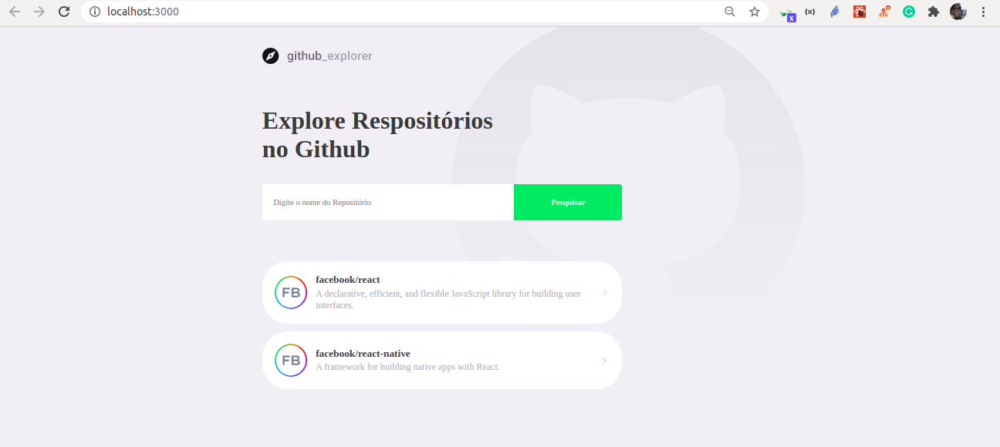
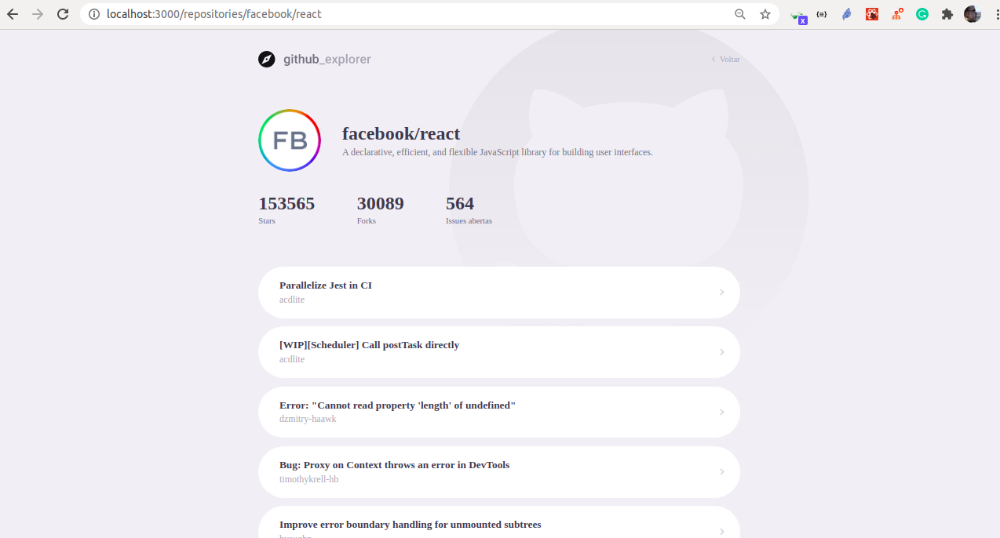

# Learning litle more about React.

## Studyng React and Styled Components while consulting Github API.

## Techs and packages envolved
- [React](https://pt-br.reactjs.org/)
- [Styled Components](https://styled-components.com/)
- [TypeScript](https://www.typescriptlang.org/)
- [React Router DOM](https://reactrouter.com/web/guides/quick-start)
- [React Icons](https://github.com/react-icons/react-icons)
- [Polished](https://polished.js.org/docs/)
    

### Pré-requisitos

You need to have Git and Yarn (package manager) before start:

[Git](https://git-scm.com), [Yarn](https://classic.yarnpkg.com/en/docs/install).


### 🎲 Running

```bash
# Clone this repository
$ git clone <https://github.com/rudineybarbosa/05-primeiro-projeto-react.git>

# Access project folder
$ cd 05-primeiro-projeto-react  
## After checkout this repository, we can use available script below

In the project directory, you need install project dependencies with command:

### `yarn install`

Runs the app:

### `yarn start`


Open [http://localhost:3000](http://localhost:3000) to view it in the browser.
Try search for any repository on Github like 'facebook/react' or 'facebook/react-native'...
Click on selected repository to see its issues.

## Learn More

You can learn more in the [Create React App documentation](https://facebook.github.io/create-react-app/docs/getting-started).

To learn React, check out the [React documentation](https://reactjs.org/).
```
### Images

Dashboard:

<h1 align="center">
  
</h1>

Issues List:

<h1 align="center">
  
</h1>

Reference: Rocketseat - Nível 03 - Primeiro projeto com React
